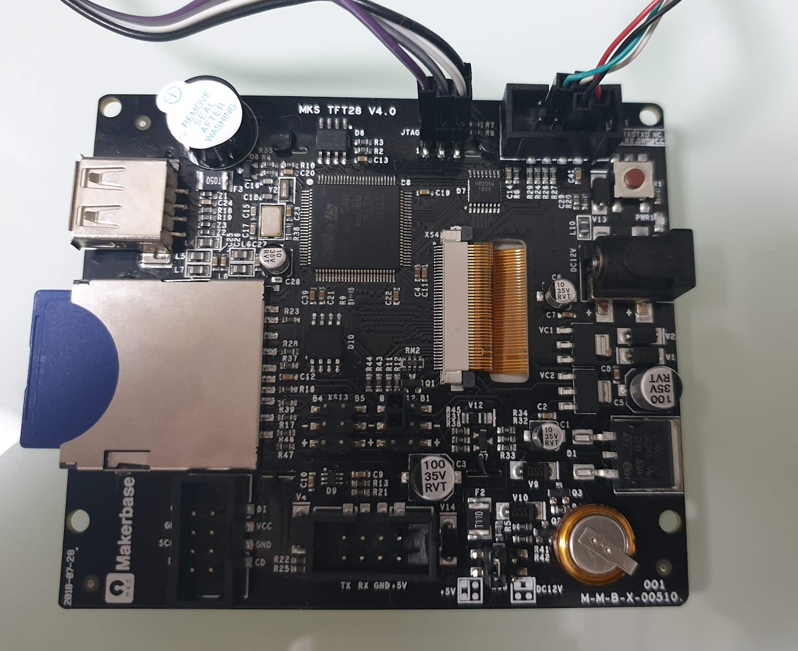
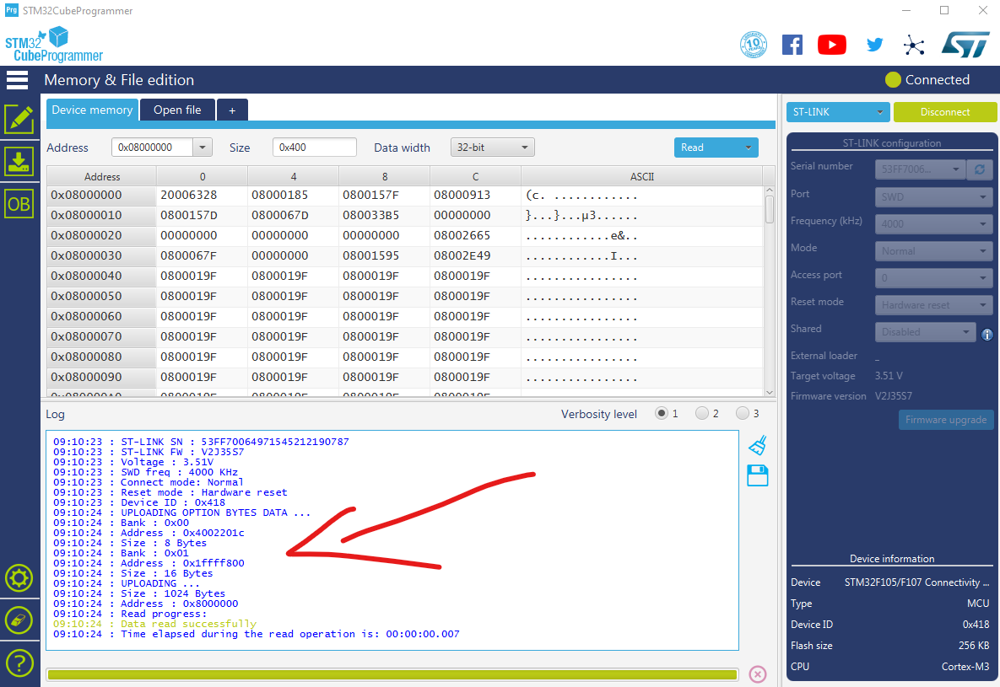
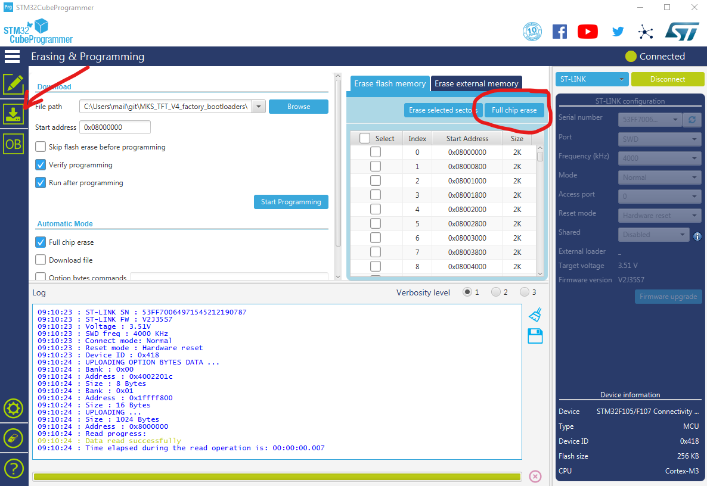
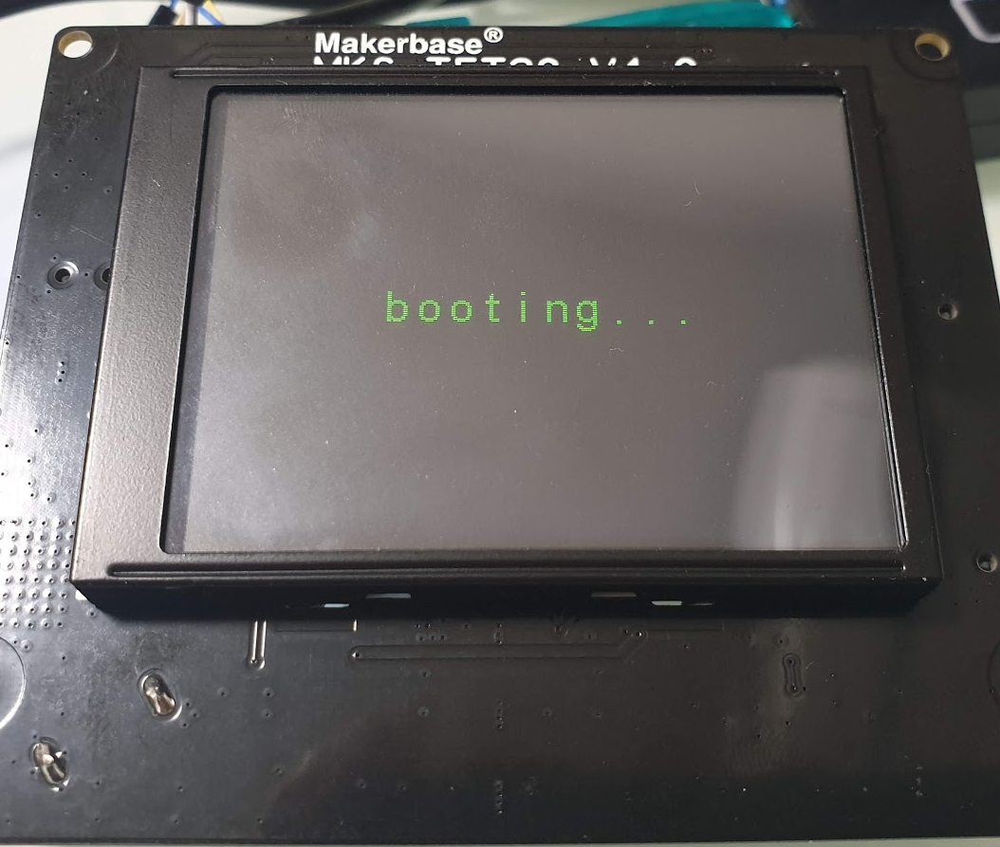

# MKS TFT Factory Boot ROM Restore Guide

The MKS TFT Display boards relay on Makerbase's proprietry Bootloader to install their Firmware and initialise the board. For those who have erased their device it's been impossible to reresore these baords to their original....'glory'. 

Special thanks to [@darkspr1te](https://github.com/darkspr1te) for retrieving the original bootrom from the MKS boards which made this guide possible. 

### Requirements
1. Basic understanding of how to program microcontrollers (Arduino, etc).
2. STM32 ST-Link Programmer and cables, [Something Like This](https://www.amazon.com/WINGONEER®-Cortex-M0-Cortex-M3-Interface-Programmer/dp/B012VR3PVA/ref=cm_cr_arp_d_product_top?ie=UTF8).
3. STM32CubeProgrammer Software, downleded from [ST's Site](https://www.st.com/en/development-tools/stm32cubeprog.html).
4. A means to power the MKS board. (DC12V supply, USB-to-Serial cable, etc).
5. The firmware files wihtin this repo. 

## Connecting ST-LINK v2 to the MKS TFT: 
Connect up your ST-Link Programmer, In my case, the JTAG header is the closest STM32 chip and it's pin assignments are listed below. 

    ST-LINK    MKS-TFT32: 
    5v         AUX-1 5v 
    GND        AUX-1 GND 
    SWDIO      JTAG pin 4 
    SWCLK      JTAG pin 5 

I'm using the UART header to power my board using a USB-to-Serial Cable. This is not needed, you can use a DC power source. Do not power the board form the ST-Link Programmer.

## Uploading BOOTROM

1. Start STM32CubeProgrammer and 'Connect' to your MKS Board. If everything is connected and powered correctly, you should see the chip information displayed. 

2. Head over the to 'Erasing & Programming' section (note red arrow below). 
3. For good measure I run the 'Full chip erase'. 
4. Select the correct boot rom in the 'File Path' Section. I have included bootsoms for v4. and v1. in this repo. NThe current board is v4.0. 
5. Hit the 'Start Programming' Button. 

6. If everything has gone according to plan, the board should boot up and the screen will display the message 'booting'.
7. Simply load the [MKS TFT Firmware](https://github.com/makerbase-mks/MKS-TFT) onto the SD Card and reboot. The unit will restore the firmware you've provided and reboot into the GUI we love so much. 

